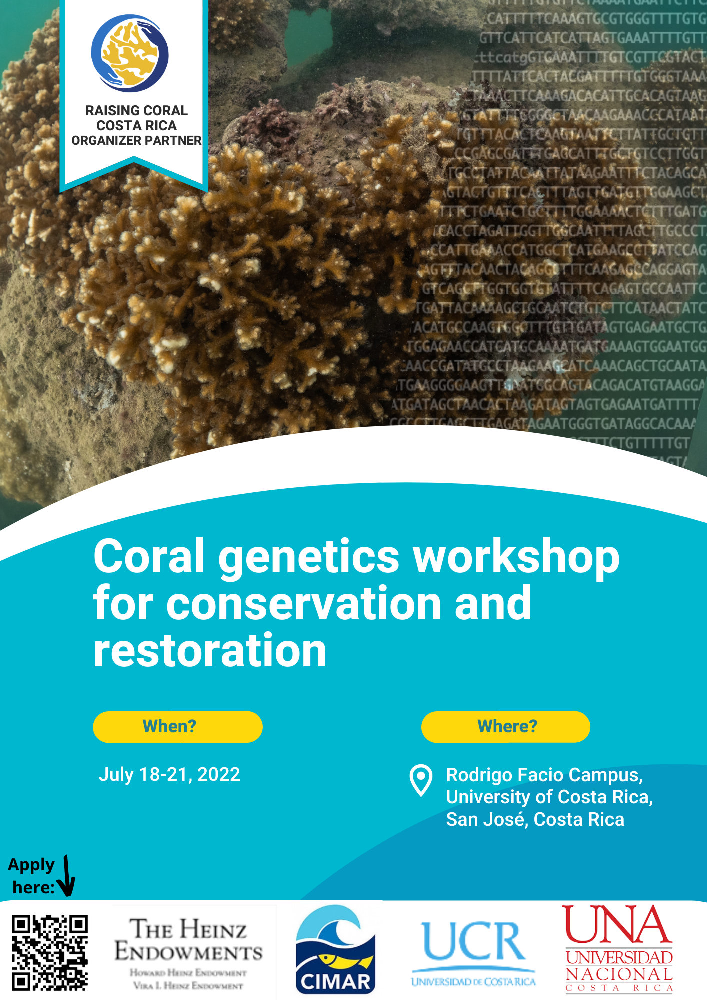

## Coral genetics workshop for conservation and restoration  
#### Building capacity for genetic analysis to support coral reef restoration in Costa Rica

## Taller genética de corales para la conservación y restauración
#### Creación de capacidad nacional para el análisis genético de corales con fines de restauración y conservación de arrecifes coralinos en Costa Rica

